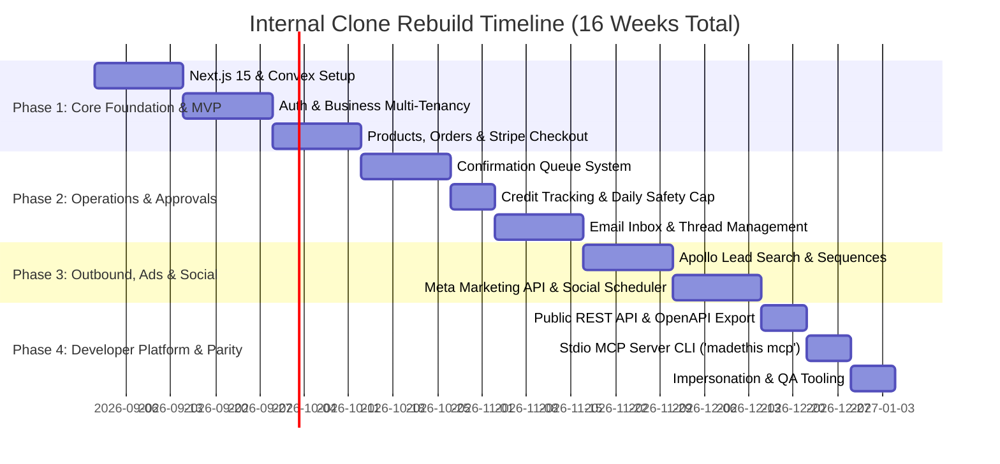

# Reverse-Engineering & Rebuild Plan: MadeThis (Internal 1:1 Clone)

**Target System:** [MadeThis](https://madethis.com)  
**Parent Company:** Castar Ventures, Inc.  
**Author / Assessor:** Technical Architecture Team  
**Date:** August 2026  
**Document Status:** Final Analysis & Implementation Roadmap (incl. authenticated deep-dive — see §8–§9)  

**Method:** (1) public-surface fetching (HTML, headers, robots, sitemap, docs, OpenAPI 3.1); (2) authenticated capture of the owner's own session — 4 HAR exports incl. websocket frames; (3) live inspection of the app's Files UI via browser automation. Branding out of scope per instruction.

**Companion documents:**
- [`madethis-convex-api-reference.md`](madethis-convex-api-reference.md) — every observed internal Convex function with args + inferred output schema, plus the sync protocol and generated-site teardown.
- [`madethis-agent-architecture.md`](madethis-agent-architecture.md) — the agent operating system (canonical context files, CEO→worker model, task dispatch), the live workspace inventory, and the `playbooks.ts` conclusion.
- [`prompts/`](prompts/INDEX.md) — extracted agent context files & skill prompts (study only; do not reuse verbatim).

---

## 1. What It Is

### Product Purpose
MadeThis is an **autonomous AI co-founder platform** designed to turn natural-language business concepts into fully operational, revenue-generating online businesses. Rather than operating as a simple coding assistant or static website builder, MadeThis provides an integrated team of specialized AI agents that build, launch, market, and operate digital enterprises with human-in-the-loop oversight.

### Target Audience
*   **Solo Founders & Entrepreneurs:** Creators and non-technical founders looking to validate and scale business ideas without hiring developers, designers, or marketers.
*   **Small Business Owners & Agencies:** Service providers (photography, handyman, consulting, ceramics) seeking automated lead capture, quote generation, and marketing automation.
*   **Creators & Educators:** Online course creators, digital product sellers, and e-commerce operators needing storefronts, payment processing, and customer support.
*   **Developers & Coding Agents:** Technical users who leverage the MadeThis HTTP API and stdio MCP server (`madethis mcp`) to use MadeThis as programmatic business infrastructure from external AI agents.

### Core Value Proposition
1.  **Autonomous Operations ("AI Co-Founder"):** Replaces the multi-disciplinary human team required to start a business (developer, designer, marketer, salesperson, support agent) with coordinated AI software agents.
2.  **Plain Language Interface with Human-in-the-Loop Safeguards:** Owners direct their business via plain text, while consequential actions (such as spend commitments, lead enrollment, or refunds) are parked in a confirmation queue (`/v1/confirmations`) for manual approval or run within strict daily Autopilot safety caps.
3.  **Unified Business Infrastructure:** Integrates website/landing page generation, Stripe payment links, domain management, business email inboxes, cold outbound outreach, Meta ad management, and social media scheduling into a single control pane.
4.  **Developer & MCP Accessibility:** Exposes all business primitives via an OpenAPI 3.1 REST API (`https://api.madethis.com/v1`) and a local Model Context Protocol (MCP) server for seamless AI-agent-to-AI-agent orchestration.

---

## 2. Frontend Stack Analysis

| Component | Technical Selection / Implementation | Confidence | Empirical Evidence / Artifact |
| :--- | :--- | :--- | :--- |
| **Framework** | React 19 / 18 (React Server Components) | **Verified** | `Link` preloads in HTML head, React Server Component payloads in `<script>` tags (`self.__next_f.push`), RSC component IDs (`ClientClerkProvider`, `ConvexClientProvider`). |
| **Meta-Framework** | Next.js (App Router) | **Verified** | `x-powered-by: Next.js` header, `vary: rsc, next-router-state-tree`, `/_next/static/` asset paths, `dpl` query parameter (`dpl_5ayfu6ycKr3rQQ1RZ2gwF4TNmHJ1`). |
| **Bundler** | Turbopack | **Verified** | `/_next/static/chunks/turbopack-134efys5-buid.js` bundled in HTML. |
| **Styling Approach** | Tailwind CSS v3/v4 + Google Fonts | **Verified** | Tailwind utility classes (`bg-brand-cream`, `text-brand-charcoal`, `max-w-[1440px]`, `border-brand-border-strong`), preloaded fonts (`Inter`, `Instrument Serif`, `Inria Serif`, `Geist Mono`). |
| **Hosting & CDN** | Vercel Edge Network | **Verified** | Response headers `server: Vercel`, `x-vercel-cache: MISS`, `x-vercel-id: lhr1::iad1...`, DNS record `7fc0764b00078b7e.vercel-dns-016.com`. |
| **DNS Provider** | Cloudflare DNS | **Verified** | NS records `dan.ns.cloudflare.com`, `autumn.ns.cloudflare.com`. |
| **Client Authentication** | Clerk (`@clerk/nextjs` v7.0.7) | **Verified** | `x-clerk-auth-status: signed-out`, `x-clerk-auth-reason`, publishable key `pk_live_Y2xlcmsubWFkZXRoaXMuY29tJA==`, script `https://clerk.madethis.com/npm/@clerk/clerk-js@6/dist/clerk.browser.js`. |
| **Client Realtime & State** | Convex Client (`ConvexClientProvider`) | **Verified** | `connect-src wss://*.convex.cloud`, bundle reference `https://grandiose-goshawk-617.convex.cloud`, `convex-usher` response headers. |
| **Analytics & Telemetry** | PostHog, Google Analytics, Sentry, Meta Pixel | **Verified** | `PostHogUserIdentifier`, `GoogleAnalyticsTag` (ID `G-5HF5XJWHVG`), `MetaPixel` (ID `1791060681870719`), CSP headers targeting `*.ingest.sentry.io` and `us.posthog.com`. |
| **Bot Protection** | Cloudflare Turnstile | **Verified** | CSP frame-src and script-src explicitly permitting `https://challenges.cloudflare.com`. |
| **Iconography** | Custom SVG / Phosphor Icons | **Verified** | Inline `<svg>` tags with attributes `data-platform-icon=""` and `data-platform-icon-weight="regular"`. |
| **Favicon & Web App Manifest** | Next.js Metadata Route | **Verified** | Standard links: `/favicon.ico`, `/icon-192.png`, `/favicon-light.svg`, `/favicon-dark.svg`, `/apple-touch-icon.png`, `/manifest.webmanifest`. |

---

## 3. Backend & API Infrastructure

### API Architecture & Connectivity
*   **API Base URL:** `https://api.madethis.com/v1` **[Verified]**
*   **Production Backend Hosting:** Convex Cloud Deployment (`https://grandiose-goshawk-617.convex.cloud`) **[Verified via JS bundle string inspection and HTTP headers `via: 1.1 Caddy`, `convex-usher: usher`]**.
*   **Schema Generation:** Auto-generated from Convex TypeScript definitions at `convex/api/registry.ts` **[Verified via `info.description` in `https://madethis.com/openapi.json`]**.
*   **OpenAPI Contract:** OpenAPI 3.1.0 specification publicly served at `https://madethis.com/openapi.json` **[Verified]**.

### Authentication & Authorization Mechanics
1.  **Web Dashboard Auth:** Managed via Clerk (`clerk.madethis.com`). Authenticated users receive JWT session tokens for interactive React operations **[Verified]**.
2.  **API & CLI Authorization:** HTTP API requests use business-scoped Bearer API keys (`Authorization: Bearer mt_live_...`). Keys are minted either in user settings or via the CLI pairing flow (`madethis login`) **[Verified]**.
3.  **Fine-Grained Scopes:** API keys support granular scopes: `read`, `write`, `money`, and `ads`. The `money` scope (granting checkout creation and payout access) is restricted to business owners **[Verified via `/docs/api/errors`]**.
4.  **Idempotency Protection:** Mutation endpoints require an `Idempotency-Key` header (1–128 ASCII characters). Re-sending a request with the same idempotency key replays the cached result, preventing accidental duplicate billing, product creation, or refunds **[Verified]**.

### Error Response Schema
All API routes return a standardized JSON error envelope:
```json
{
  "error": {
    "code": "validation_failed",
    "message": "priceAmountCents must be an integer",
    "docs_url": "https://madethis.com/docs/api/errors#validation_failed"
  }
}
```
**Stable Error Codes [Verified via `/docs/api/errors`]:**
*   `unauthorized` (401): Missing or malformed Bearer key.
*   `forbidden_scope` (403): API key lacks required scope (`read`, `write`, `money`, `ads`).
*   `not_found` (404): Path missing or resource belongs to another business (avoids ID probing).
*   `validation_failed` (400): Parameter type or range violation.
*   `rate_limited` (429): Rate cap reached (returns `Retry-After` header).
*   `credits_exhausted` (402): Account credit balance depleted.
*   `plan_required` (403): Feature unavailable on current subscription tier.
*   `confirmation_required` (409): Action requires manual human confirmation.
*   `idempotency_conflict` (409): Concurrent request with identical idempotency key.
*   `internal` (500): Unhandled backend error.

### Observable Endpoint Inventory (from OpenAPI 3.1 Contract)

| Category | HTTP Method & Path | Summary / Description | Security Scope Required |
| :--- | :--- | :--- | :--- |
| **Business** | `GET /v1/business` | Get authenticated business details | `apiKey` |
| | `PATCH /v1/business` | Update checkout return URLs & unattended spend policy | `apiKey` (`write`) |
| **Usage** | `GET /v1/usage` | Check credit balance, plan limits, and write allowance | `apiKey` |
| **Confirmations** | `GET /v1/confirmations` | List pending actions requiring human approval | `apiKey` |
| | `GET /v1/confirmations/{id}` | Get details and stored result of a confirmation | `apiKey` |
| | `POST /v1/confirmations/{id}/confirm` | Execute a parked action exactly once | `apiKey` (`write`) |
| | `POST /v1/confirmations/{id}/reject` | Cancel a parked action permanently | `apiKey` (`write`) |
| **Products & Media**| `GET /v1/products` | List all business products | `apiKey` |
| | `POST /v1/products` | Create a product (syncs to Stripe upon activation) | `apiKey` (`write`) |
| | `GET /v1/products/{id}` | Get product details | `apiKey` |
| | `PATCH /v1/products/{id}` | Update product attributes or archive | `apiKey` (`write`) |
| | `POST /v1/checkout-links` | Generate shareable Stripe checkout URL | `apiKey` (`money`) |
| | `POST /v1/files` | Get signed URL to upload product deliverable | `apiKey` (`write`) |
| | `POST /v1/files/complete` | Finalize file upload and receive permanent URL | `apiKey` (`write`) |
| **Orders & Shipments**| `GET /v1/orders` | List customer orders | `apiKey` |
| | `GET /v1/orders/{id}` | Get detailed order record | `apiKey` |
| | `POST /v1/orders/{id}/refund` | Process full/partial refund (Idempotency required) | `apiKey` (`money`) |
| | `POST /v1/orders/{id}/ship` | Mark physical order shipped with tracking code | `apiKey` (`write`) |
| **Payouts** | `GET /v1/payouts` | Payout status and Stripe Connect eligibility | `apiKey` (`money`) |
| | `POST /v1/payouts/onboarding-link`| Generate Stripe Connect onboarding link | `apiKey` (`money`) |
| **Email & Messaging**| `GET /v1/email/inbox` | Get business inbox address & provisioning state | `apiKey` |
| | `POST /v1/email/inbox` | Provision dedicated business email inbox | `apiKey` (`write`) |
| | `POST /v1/email/send` | Send email from business inbox (daily cap enforced) | `apiKey` (`write`) |
| | `GET /v1/email/threads` | List customer email communication threads | `apiKey` |
| | `GET /v1/email/threads/{id}` | Get full email thread message history | `apiKey` |
| **Leads & Outbound**| `GET /v1/leads` | List acquired leads | `apiKey` |
| | `POST /v1/leads/import` | Bulk import lead list with deduplication | `apiKey` (`write`) |
| | `POST /v1/leads/search` | Search ICP leads (billed per Apollo enrichment) | `apiKey` (`write`) |
| | `GET /v1/sequences` | List cold-email outbound campaign sequences | `apiKey` |
| | `POST /v1/sequences` | Create cold-email sequence draft | `apiKey` (`write`) |
| | `POST /v1/sequences/{id}/cancel` | Cancel sequence permanently | `apiKey` (`write`) |
| | `POST /v1/sequences/{id}/leads` | Enroll leads and begin sending (requires confirmation)| `apiKey` (`write`) |
| | `POST /v1/sequences/{id}/pause` | Pause sequence execution | `apiKey` (`write`) |
| | `POST /v1/sequences/{id}/resume` | Resume paused sequence | `apiKey` (`write`) |
| **Ads & Marketing** | `GET /v1/ads` | List ad campaigns and budget status | `apiKey` (`ads`) |
| | `PATCH /v1/ads/{id}/budget` | Update daily ad budget (spend-policy gated) | `apiKey` (`ads`) |
| | `GET /v1/ads/{id}/insights` | Get campaign analytics (~30 min Meta lag) | `apiKey` (`ads`) |
| | `POST /v1/ads/{id}/pause` | Pause ad campaign (always allowed) | `apiKey` (`ads`) |
| | `POST /v1/ads/interests` | Query Meta targeting catalog for interest names | `apiKey` (`ads`) |
| | `POST /v1/ads/publish` | Create & launch Meta ad campaign (async, gated) | `apiKey` (`ads`) |
| **Social Media** | `GET /v1/social/accounts` | Connected social accounts & postability status | `apiKey` |
| | `POST /v1/social/connect` | Generate OAuth link to connect social profile | `apiKey` (`write`) |
| | `GET /v1/social/posts` | List social media posts | `apiKey` |
| | `POST /v1/social/posts` | Schedule or publish social post | `apiKey` (`write`) |
| | `DELETE /v1/social/posts/{id}`| Cancel scheduled post | `apiKey` (`write`) |
| | `POST /v1/social/posts/{id}/retry`| Retry failed post publishing | `apiKey` (`write`) |
| **Domains** | `GET /v1/domains` | List registered domains & missing DNS records | `apiKey` |
| | `POST /v1/domains` | Register self-hosted custom domain | `apiKey` (`write`) |
| | `DELETE /v1/domains/{id}` | Remove custom domain configuration | `apiKey` (`write`) |
| | `POST /v1/domains/{id}/verify`| Trigger DNS verification check | `apiKey` (`write`) |
| **Webhooks** | `GET /v1/webhooks` | List registered webhook endpoints | `apiKey` |
| | `POST /v1/webhooks` | Register webhook endpoint (returns HMAC secret once) | `apiKey` (`write`) |
| | `DELETE /v1/webhooks/{id}` | Delete webhook listener | `apiKey` (`write`) |
| **CLI Auth Pairing**| `POST /v1/cli-auth/start` | Initiate CLI login pairing code | Public |
| | `POST /v1/cli-auth/poll` | Poll pairing code status for token issuance | Public |

### Integrated Third-Party Services
1.  **Stripe & Stripe Connect:** Payments, customer checkout sessions, refund management, seller onboarding (`/v1/payouts/onboarding-link`).
2.  **Apollo.io:** ICP lead search and enrichment (`/v1/leads/search`).
3.  **Meta (Facebook & Instagram) Graph API:** Ad targeting interest lookup (`/v1/ads/interests`), ad publishing (`/v1/ads/publish`), campaign performance insights.
4.  **E2B (`*.e2b.app`):** Cloud sandboxing for dynamic code execution / asset generation. **[Inferred from CSP/bundle strings — not seen on the wire in the HAR capture; treat as unconfirmed.]**
5.  **Email provider (cold outbound + inboxes):** **[Inferred]** originally read as Resend/SMTP; the authenticated business record instead shows **AgentMail** (`agentmailEmailAddress: team@{slug}.madethis.app`) as the business-inbox provider — see §8.
6.  **Mux:** Video hosting/streaming for generated storefronts (HLS hero video). **[Verified in HAR: `stream.mux.com`, `edgemv.mux.com`.]**
7.  **Convex file storage:** `GET https://<deployment>.convex.cloud/api/storage/{uuid}` for uploaded deliverables/assets. **[Verified in HAR.]**

---

## 4. Site Structure & Information Architecture

```
madethis.com (Root Domain)
├── / (Home / Landing Page)
├── /about (Mission, Castar Ventures Inc, Belief Model)
├── /pricing (Starter $49/mo, Growth $79/mo, Scale $199/mo, Enterprise $5k+/mo)
├── /enterprise (4-Week AI Employee Deployment Workflow)
├── /contact (Customer & Product Support Contact)
├── /careers (Job Openings)
├── /terms (Terms of Service)
├── /privacy (Privacy Policy)
├── /support (Help Center)
│
├── Developer Documentation & API:
│   ├── /docs (Developer Portal Overview)
│   ├── /docs/api (API Quickstart & Authentication Guide)
│   ├── /docs/api/errors (Machine-Readable Error Reference)
│   ├── /openapi.json (OpenAPI 3.1.0 JSON Schema Contract)
│   ├── /llms.txt (Structured LLM / AI Agent Sitemap & Description)
│   └── /api-keys (Business-Scoped API Key Management - Auth Required)
│
├── Authentication Routes:
│   ├── /signup (Clerk User Registration)
│   └── /login (Clerk User Authentication)
│
└── Authenticated Application Space (Disallowed in robots.txt):
    ├── /dashboard (Main AI Co-Founder Chat Workspace & Task Monitor)
    ├── /dashboard/businesses (Multi-Business Switcher)
    ├── /dashboard/products (Catalog & Deliverable Management)
    ├── /dashboard/orders (Order Fulfillment & Refund Management)
    ├── /dashboard/leads (Lead Lists & Outbound Campaigns)
    ├── /dashboard/marketing (Meta Ads & Social Scheduler)
    ├── /dashboard/inbox (Email Threads & Automated Customer Support)
    ├── /dashboard/domains (Custom Subdomain / CNAME Configuration)
    ├── /dashboard/settings (Team Roles, Spend Guardrails, API Keys)
    ├── /billing (Stripe Subscription Management & Top-Up Credits)
    └── /admin (Internal Impersonation & Fixture Tooling)
```

### Crawl & Indexing Rules (`robots.txt`) **[Verified]**
```txt
User-Agent: *
Allow: /
Disallow: /dashboard/
Disallow: /admin/
Disallow: /api/
Disallow: /billing/

Sitemap: https://madethis.com/sitemap.xml
```

---

## 5. Functional Flows by Role

```mermaid
flowchart TD
    subgraph Role1 ["Role 1: Business Owner"]
        A[Enter Idea in Workspace Chat] --> B[AI Co-Founder Generates Plan & Assets]
        B --> C{Consequential Action?}
        C -- Yes --> D[Park in Confirmation Queue]
        D --> E[Owner Confirms / Rejects Action]
        C -- No / Autopilot --> F[Auto-Execute Action]
        E -- Confirmed --> F
        F --> G[Run Business: Sales, Emails, Ads]
    end

    subgraph Role2 ["Role 2: Coding Agent / Developer"]
        H[Mint Bearer Key at /api-keys] --> I[Run 'madethis mcp' Stdio Server]
        I --> J[Invoke OpenAPI Endpoints via HTTP / MCP]
        J --> K[Manage Products, Outbound, Webhooks Programmatically]
    end

    subgraph Role3 ["Role 3: End Customer"]
        L[Visit Business Subdomain / Custom Domain] --> M[Select Product & Complete Checkout]
        M --> N[Receive Automated Deliverable & Confirmation Email]
    end
```



### Role 1: Business Owner / Solo Founder
1.  **Idea Initiation to Launch:** The owner inputs a natural language business concept (e.g., *"Photography business for wedding portraits with online booking"*). Specialized AI agents generate website structure, brand copy, product pricing tiers, and Stripe checkout links.
2.  **Human-in-the-Loop Approval:** Actions involving spend, lead enrollment, or refund processing are placed in the confirmation queue (`GET /v1/confirmations`). The owner receives a notification and clicks to confirm (`POST /v1/confirmations/{id}/confirm`) or reject.
3.  **Autopilot Configuration:** The owner enables Autopilot mode within strict credit safety limits (Starter: 1,200 credits/day; Growth: 3,000 credits/day; Scale: 20,000 credits/day). Autopilot automatically answers support emails, posts social content, and manages ad spend until the daily safety cap is reached.
4.  **Payout Onboarding:** Owner initiates Stripe Connect onboarding via `/v1/payouts/onboarding-link` to receive direct payouts from product sales.

### Role 2: Developer / Agent Integrator
1.  **Headless API Provisioning:** Developer signs in, navigates to `/api-keys`, and mints a Bearer token (`mt_live_...`) with specific scopes (`read`, `write`, `money`, `ads`).
2.  **MCP Server Pairing:** Developer authenticates the local CLI (`madethis login`) and starts the stdio MCP server (`madethis mcp`). External coding agents (Cursor, Claude, Antigravity) call MadeThis primitives directly without handling raw secrets.
3.  **Webhook Event Subscription:** Developer registers a webhook endpoint (`POST /v1/webhooks`) to receive HMAC-signed HTTP notifications when orders are completed, leads are enriched, or ad campaigns finish processing.

### Role 3: End Customer (Buyer / Lead)
1.  **Storefront Discovery:** Customer navigates to a MadeThis-hosted domain (`businessname.madethis.app` or custom CNAME domain).
2.  **Seamless Checkout:** Customer clicks buy, completes payment on a secure Stripe-hosted checkout page, and receives an automated confirmation email sent from the business inbox.
3.  **Support Interaction:** Customer replies to an inquiry; the AI inbox agent drafts or sends a response based on business context.

### Role 4: Platform Administrator (Internal Team)
1.  **User Impersonation & Debugging:** Admins locate user accounts via `api.impersonation.searchUsers` and trigger an impersonation session (`api.impersonation.impersonate`) to inspect agent state or diagnose execution errors.
2.  **QA Fixture Generation:** Engineers execute `api.qa.fixtures` to populate mock orders, leads, and confirmation states during integration testing.

---

## 6. Rebuild Plan for Internal Clone

### Proposed Technology Stack

| Layer | Technical Choice | Justification |
| :--- | :--- | :--- |
| **Frontend Framework** | Next.js 15 (App Router, React 19, TypeScript) | Matches original architecture; provides optimal SSR/RSC performance and API route hosting. |
| **Styling & UI Components** | Tailwind CSS v4 + Shadcn UI + Lucide Icons | Enables rapid construction of sleek, dark/cream minimal interfaces matching modern design standards. |
| **Authentication** | Clerk (or Auth.js / Better-Auth for 100% self-hosted) | Provides immediate multi-tenant user management, organization switching, and API key management. |
| **Realtime Database & Backend**| Convex (Convex Cloud or Self-Hosted Convex) | 1:1 match with MadeThis backend architecture. Provides reactive TypeScript queries/mutations, automated OpenAPI schema generation, and built-in cron scheduling. |
| **Agent Orchestration** | LangChain / Vercel AI SDK + Claude 3.5 Sonnet / Gemini 2.5 | Provides robust structured JSON tool calling, state management, and multi-agent delegation. |
| **Sandboxed Code Execution** | E2B Sandbox API (`e2b.dev`) | 1:1 match with original infrastructure for isolated web code generation and dynamic script execution. |
| **Payments & Payouts** | Stripe & Stripe Connect | Standard for product creation, checkout sessions, webhooks, and seller payout routing. |
| **Email Infrastructure** | Resend + Cloudflare Email Routing | Enables automated domain inbox creation, inbound webhook processing, and cold outbound emailing. |
| **Data Enrichment & Lead Generation**| Apollo.io REST API | Powers ICP lead discovery and contact enrichment. |
| **Ad Platform Integration** | Meta Marketing API (Graph API) | Powers ad budget controls, targeting lookup, and campaign publishing. |

### Data Model Sketch (Convex Schema Definitions)

```typescript
// convex/schema.ts
import { defineSchema, defineTable } from "convex/server";
import { v } from "convex/values";

export default defineSchema({
  users: defineTable({
    clerkId: v.string(),
    email: v.string(),
    role: v.union(v.literal("owner"), v.literal("admin"), v.literal("member")),
    timezone: v.string(),
    createdAt: v.number(),
  }).index("by_clerkId", ["clerkId"]),

  businesses: defineTable({
    ownerId: v.id("users"),
    name: v.string(),
    domain: v.optional(v.string()),
    subdomain: v.string(),
    checkoutReturnUrl: v.optional(v.string()),
    unattendedSpendPolicy: v.object({
      maxDailySpendCents: v.number(),
      requireApprovalAboveCents: v.number(),
    }),
    createdAt: v.number(),
  }).index("by_owner", ["ownerId"]).index("by_subdomain", ["subdomain"]),

  credits: defineTable({
    businessId: v.id("businesses"),
    plan: v.union(v.literal("starter"), v.literal("growth"), v.literal("scale"), v.literal("enterprise")),
    monthlyAllowance: v.number(),
    usedMonthly: v.number(),
    dailySafetyCap: v.number(),
    usedToday: v.number(),
    lastResetTimestamp: v.number(),
  }).index("by_business", ["businessId"]),

  confirmations: defineTable({
    businessId: v.id("businesses"),
    actionType: v.string(), // "ads.publish", "sequences.enroll", "orders.refund"
    payload: v.any(),
    status: v.union(v.literal("awaiting_approval"), v.literal("confirmed"), v.literal("rejected")),
    storedResult: v.optional(v.any()),
    createdAt: v.number(),
  }).index("by_business_status", ["businessId", "status"]),

  products: defineTable({
    businessId: v.id("businesses"),
    title: v.string(),
    description: v.string(),
    priceAmountCents: v.number(),
    currency: v.string(),
    stripeProductId: v.optional(v.string()),
    stripePriceId: v.optional(v.string()),
    status: v.union(v.literal("active"), v.literal("draft"), v.literal("archived")),
    deliverableFileUrl: v.optional(v.string()),
  }).index("by_business", ["businessId"]),

  orders: defineTable({
    businessId: v.id("businesses"),
    productId: v.id("products"),
    customerEmail: v.string(),
    amountCents: v.number(),
    currency: v.string(),
    status: v.union(v.literal("paid"), v.literal("refunded"), v.literal("shipped")),
    shippingTrackingCode: v.optional(v.string()),
    idempotencyKey: v.optional(v.string()),
    createdAt: v.number(),
  }).index("by_business", ["businessId"]),

  leads: defineTable({
    businessId: v.id("businesses"),
    email: v.string(),
    name: v.optional(v.string()),
    company: v.optional(v.string()),
    apolloId: v.optional(v.string()),
    status: v.string(),
  }).index("by_business_email", ["businessId", "email"]),

  sequences: defineTable({
    businessId: v.id("businesses"),
    name: v.string(),
    status: v.union(v.literal("draft"), v.literal("active"), v.literal("paused"), v.literal("cancelled")),
    stepsJson: v.string(),
    enrolledLeadCount: v.number(),
  }).index("by_business", ["businessId"]),

  social_posts: defineTable({
    businessId: v.id("businesses"),
    platforms: v.array(v.string()), // ["twitter", "linkedin", "instagram"]
    content: v.object({
      title: v.optional(v.string()),
      text: v.string(),
      mediaUrls: v.array(v.string()),
    }),
    scheduledAt: v.number(),
    status: v.union(v.literal("scheduled"), v.literal("published"), v.literal("failed")),
  }).index("by_business_status", ["businessId", "status"]),

  api_keys: defineTable({
    businessId: v.id("businesses"),
    keyHash: v.string(),
    name: v.string(),
    scopes: v.array(v.string()), // ["read", "write", "money", "ads"]
    revokedAt: v.optional(v.number()),
    createdAt: v.number(),
  }).index("by_hash", ["keyHash"]).index("by_business", ["businessId"]),

  webhooks: defineTable({
    businessId: v.id("businesses"),
    url: v.string(),
    secret: v.string(),
    events: v.array(v.string()),
    status: v.union(v.literal("active"), v.literal("disabled")),
  }).index("by_business", ["businessId"]),
});
```

### Phased Execution Roadmap



#### Phase 1: Core Foundation & MVP (Weeks 1–6)
*   Setup Next.js 15 App Router codebase with Tailwind CSS v4 and Shadcn UI.
*   Deploy Convex backend schema (`users`, `businesses`, `products`, `orders`).
*   Integrate Clerk authentication for login/signup and business context switching.
*   Implement Stripe Checkout link generation and basic webhook handlers for order fulfillment.
*   Build basic workspace chat interface using Vercel AI SDK and E2B sandbox for dynamic code generation.

#### Phase 2: Human-in-the-Loop & Operations (Weeks 7–10)
*   Implement the Confirmation Queue engine (`GET /v1/confirmations`, approve/reject actions).
*   Build credit balance tracking, plan enforcement (Starter / Growth / Scale), and daily safety cap logic.
*   Integrate Resend for business email inbox creation, inbound thread tracking, and automated replies.
*   Implement custom CNAME domain verification workflow.

#### Phase 3: Outbound Marketing, Ads & Social (Weeks 11–13)
*   Integrate Apollo.io API for lead search (`/v1/leads/search`) and lead list import.
*   Build cold-email outbound sequence runner with pause/resume controls.
*   Integrate Meta Marketing API for interest lookup, budget adjustment, and campaign deployment.
*   Implement multi-platform social media post scheduler.

#### Phase 4: Developer Platform & Parity (Weeks 14–16)
*   Expose public HTTP REST API (`https://api.madethis.com/v1`) via Convex HTTP actions.
*   Build API key management (`/api-keys`) with granular scope verification (`read`, `write`, `money`, `ads`).
*   Implement `Idempotency-Key` processing middleware.
*   Develop `madethis` Node.js CLI tool with local stdio MCP server wrapper (`madethis mcp`).
*   Build internal admin user impersonation (`api.impersonation.impersonate`) and QA fixture generator.

### Effort Estimate
*   **Team Composition:**
    *   1 Full-Stack Lead Engineer (Next.js, Convex, Stripe, UI/UX)
    *   1 AI & Infrastructure Engineer (LLM Orchestration, E2B, API Integrations, MCP)
*   **Total Duration:** 16 Weeks (approx. 4–5 Engineering Months).

### Biggest Unknowns & Execution Risks

| Unknown / Risk | Impact | Risk Mitigation Strategy |
| :--- | :--- | :--- |
| **1. Meta Marketing API Approval Delays** | High | Meta App Review for Ads Management API access can take 4-8 weeks. Apply early for Development Mode credentials and use sandbox test accounts for Phase 3 development. |
| **2. Email Deliverability & Domain Reputation** | High | Automated cold outbound from newly provisioned business inboxes risks spam placement. Enforce mandatory DKIM/SPF verification and warm-up sending caps (max 50 emails/day per inbox). |
| **3. LLM Agent Cost & Runaway Loops** | High | Autonomous loops can consume huge token volumes rapidly. Enforce hard per-session credit limits and automatic circuit breakers when agent loops repeat more than 3 times without user input. |
| **4. Webhook Idempotency & Race Conditions** | Medium | Concurrent Stripe order webhooks or lead imports could cause duplicate processing. Enforce Convex database transactional mutation locks using `idempotencyKey` indices. |

---

## 7. Summary & Verification Matrix

| Claim / Component | Evidence Source | Confidence Label |
| :--- | :--- | :--- |
| **Parent Entity: Castar Ventures, Inc.** | HTML JSON-LD metadata on `/about` | **Verified** |
| **Framework: React RSC / Next.js** | HTTP Header `x-powered-by: Next.js`, RSC scripts (`__next_f`) | **Verified** |
| **Bundler: Turbopack** | Script bundle `turbopack-134efys5-buid.js` | **Verified** |
| **Hosting: Vercel** | Response Header `server: Vercel`, CNAME `vercel-dns-016.com` | **Verified** |
| **Backend: Convex Cloud** | Script string `https://grandiose-goshawk-617.convex.cloud`, Caddy header `convex-usher` | **Verified** |
| **Auth: Clerk** | Script `clerk.madethis.com`, Header `x-clerk-auth-status` | **Verified** |
| **API Endpoint Base: `https://api.madethis.com/v1`** | Live response on `curl -i https://api.madethis.com/v1/business` | **Verified** |
| **OpenAPI Schema: 3.1.0 Specification** | Public json at `https://madethis.com/openapi.json` | **Verified** |
| **CLI & MCP Server Command: `madethis mcp`** | Documentation on `/docs` and `/llms.txt` | **Verified** |
| **Idempotency Header Requirement** | Documented on `/docs` and in `openapi.json` | **Verified** |
| **Dashboard Layout & Internal Admin** | `robots.txt` disallows + JS bundle references (`api.impersonation`) | **Inferred (Structure)** / **Verified (Existence)** |
| **Behind-Auth UI Screens** | Protected by Clerk sign-in boundary | **Blocked (Direct View)** / **Verified (Schema & Contract)** |
| **App transport: Convex reactive websocket** (`wss://…convex.cloud/api/1.34.1/sync`) | HAR websocket frames | **Verified** |
| **47 internal Convex functions across 25 modules** | HAR WS frames (see reference doc) | **Verified** |
| **Agent OS: canonical context files (SOUL/OWNER/BUSINESS/PLATFORM/PLAYBOOK/RUNBOOK/MEMORY/CODE_MAP) + skills** | App bundle manifest + live Files UI | **Verified** |
| **CEO→worker (coding/browser/marketing) hierarchy + kanban task board** | HAR `agentQueries:*`, `agent/chat:sendMessage` | **Verified** |
| **Business email: AgentMail** | Business record `agentmailEmailAddress` | **Verified** |
| **Video: Mux** | HAR `stream.mux.com` | **Verified** |
| **Generated storefront = own Next.js + Convex repo; `/api/fulfillment` HMAC; `/admin` JWT gate** | Live workspace audit file | **Verified** |
| **`src/lib/templates/playbooks.ts`** | Named by live `PLAYBOOK.md` stub | **Blocked (server-side source; not client-delivered)** |
| **E2B sandbox** | CSP/bundle string only | **Inferred (not seen in HAR)** |

---

## 8. Authenticated Deep-Dive: App Backend & Generated Storefront

Everything below comes from the owner's own authenticated session (HAR websocket capture + live Files UI). It resolves what the public surface could only infer. Full function schemas: [`madethis-convex-api-reference.md`](madethis-convex-api-reference.md).

### 8.1 Corrected architecture — two backends
The first-party web + iOS app is **not** a REST client of `/v1`. It is a **Convex reactive app** talking over a websocket sync protocol (`wss://grandiose-goshawk-617.convex.cloud/api/1.34.1/sync`; frames `Connect / Authenticate / ModifyQuerySet / Mutation / Transition / QueryUpdated`). Clicking through chat and every dashboard tab produced **zero REST calls** — only Clerk (JWT auth for the socket) and PostHog. The documented **REST `/v1` API (§3) is a separate, developer-facing surface**. A faithful clone therefore needs **both**: a Convex realtime app/agent layer, and the REST API for external developers/agents.

### 8.2 Internal Convex function inventory (observed)
47 functions across ~25 modules, e.g. `businesses:getBySlug`, `agent/chat:sendMessage {businessId, content, platform}`, `agentQueries:getTaskBoard/getMessages/getActiveSession/getPendingApprovals`, `adGrowth:getGoalContract` (champion/challenger budget allocation), `outbound/queries:*`, `social:getDashboard`, `launchPlan:getLaunchPlan` (7-day launch week), `incorporation:getIncorporationOverview`, `impersonation:availability`, `usageQueries:getTodayUsage`. Full args + response schemas are in the companion reference doc. Capabilities beyond the public API: **incorporation, launchPlan, artifacts, adGrowth autonomy, memberships, referrals, impersonation, scheduledTasks, globalSearch, creative studio.**

### 8.3 Generated-storefront repo internals (from the live workspace audit file) **[Verified]**
Each produced business is its **own Next.js 15 + Convex repo** deployed to Vercel:
*   **Auth:** `@convex-dev/auth` for `/app` customer routes; `src/middleware.ts` gates `/admin(.*)` with a signed JWT from a `?token` param, stored as an HTTP-only `SameSite=Lax` `admin_token` cookie (1 hr).
*   **Storefront tables:** `users, workspaces, workspaceMembers, invitations, blogPosts`; `workspaces` carries `platformProductId, checkoutUrl, plan, subscriptionStatus`.
*   **Platform boundary:** only non-auth endpoint is `POST /api/fulfillment` (verifies `X-Fulfillment-Signature` = HMAC-SHA256 over raw body). Outbound goes to the platform's `/site/notify` proxy, HMAC-signed with `PLATFORM_FULFILLMENT_SECRET`, types `contact_inquiry, subscriber.added, purchase_receipt, password_reset, agent_reply`.
*   **Storefront env:** `NEXT_PUBLIC_CONVEX_URL, CONVEX_DEPLOY_KEY, ADMIN_TOKEN_SECRET, NEXT_PUBLIC_PLATFORM_URL, PLATFORM_FULFILLMENT_SECRET, CONVEX_SITE_URL`.
*   **Checkout:** platform-hosted Stripe Connect — storefront link → `https://madethis.com/checkout/{slug}/{productId}` → Stripe → webhook records order → redirect to storefront `/checkout/success`; order lookup via a Convex **`.site`** HTTP action `GET https://<deployment>.convex.site/checkout/order?session_id=…`.
*   **Lead:** the audit targets a `Dean-Rough/facelift` GitHub repo + `facelift-control` Vercel project — "Facelift" is the internal operating-layer/engine each business integrates with.

## 9. The Agent Operating System

Full detail (with prompt excerpts) in [`madethis-agent-architecture.md`](madethis-agent-architecture.md).

*   **File-based agent OS.** Each business is a workspace of canonical Markdown context files in 3 groups — **Identity** (`SOUL.md` persona "Wee Davy", `BUSINESS.md`, `OWNER.md`), **Operations** (`PLAYBOOK.md`, `PLATFORM.md`, `RUNBOOK.md`), **Evolving** (`MEMORY.md`, `CODE_MAP.md`) — plus `SUPPORT.md` and agent-produced artifacts (design-system audits, offer copy, prospect shortlists). Skills are prompt files with YAML frontmatter (e.g. a ~22 KB `brandkit` skill).
*   **Hierarchy.** A **CEO orchestrator** (`agentRole: ceo`) dispatches **worker agents** (`coding`, `browser`, `marketing`) as credit-costed tasks on a kanban board (`todo→in_progress→needs_review→done`). Task-dispatch prompts are hyper-specific — they name exact repo functions, add Convex indexes, pin copy, and carry `Do NOT…` guardrails, ending with build/typecheck/commit/push and a `.agent/` note.
*   **Timeline.** Chat is a typed event stream (`richContent.type`: `briefing, task_dispatch, milestone, tool_execution, llm_call, approval_resolution, owner_secret_request, workspace_file, suggestion_chips, blueprint, brand_kit, landing_page`).
*   **Guardrails.** `approvalSettings {ad_proposal, outbound_sequence, social_post}` + `autonomyMode` (autopilot vs approve-each); `owner_secret_request` = the agent formally asking the owner for a credential.
*   **`playbooks.ts`.** The live `PLAYBOOK.md` is an un-provisioned stub naming `src/lib/templates/playbooks.ts` as the per-business-type template — **server-side platform source, never delivered to any client, and unrecoverable from the app or HARs.**

### Rebuild implication
The "missing 60%" is not a monolithic prompt — it's this **OS**: canonical context files + skills-as-files + a CEO→worker dispatcher writing guardrailed task prompts against a per-business Next.js/Convex repo, over a Convex websocket, with a typed event timeline and approval gates. Replicating that *structure* (not their wording) is the real work. Fold this into the Phase-1/Phase-4 roadmap (§6): the Convex realtime layer and agent OS are Phase 1 foundations, not a Phase-4 add-on.

---
*Report generated successfully for internal clone blueprint. Deep-dive (§8–§9) reflects authenticated findings as of 2026-08-26.*
